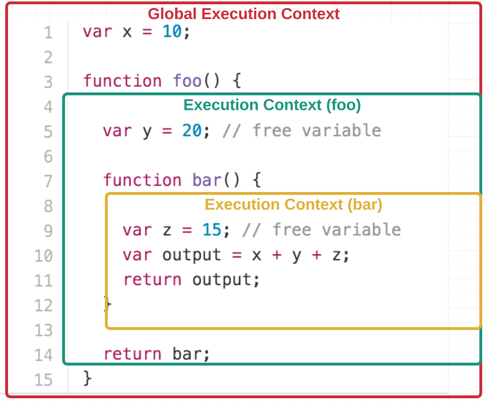

# Contents
1. [ES6 Concepts](#es6-concepts)
2. [What is the difference between array.forEach() and array.map()?](#what-is-the-difference-between-arrayforeach-and-arraymap)
3. [What is closure?](#what-is-closure)
4. [What is currying function in JavaScript ?](#what-is-currying-function-in-javascript)

## ES6 Concepts
 1. Let and Const
 2. Arrow Functiion
 3. Rest Parameter
 4. Spread Operator
 5. Class
 6. Template Literals
 7. Object and Array Destruction etc.
* Let and Const
    - Scope of Var
        - Before the advent of ES6, var declarations ruled. There are issues associated with variables declared with var. Scope essentially means where these variables are available for use. var declarations are globally scoped or function/locally scoped. The scope is global when a var variable is declared outside a function. This means that any variable that is declared with var outside a function block is available for use in the whole window.var is function scoped when it is declared within a function. This means that it is available and can be accessed only within that function.
    - var variables can be re-declared and updated
    ```
    function a(){
        var b = 'hello';
        var b = 'hello world'
    }
    a();
    ```
    - Hoisting is a JavaScript mechanism where variables and function declarations are moved to the top of their scope before code execution. So var variables are hoisted to the top of their scope and initialized with a value of undefined.
        ```
        console.log(a); // undefined
        var a;
        a = 'Hello'
        ```
    - Let and Const are block scoped
        - A block is a chunk of code bounded by {}. A block lives in curly braces. Anything within curly braces is a block. So a variable declared in a block with let  is only available for use within that block.
    - let can be updated but not re-declared
        - Just like var,  a variable declared with let can be updated within its scope. Unlike var, a let variable cannot be re-declared within its scope.
        ```
        function x(){
            let y = 'hello';
            y = 'Hello';    // No error
            let y = 'Hello World'; // Error: cant redeclare block scoped variable y
        } 
        ```
    - Hoisting of let and const
        - Just like  var, let & const declarations are hoisted to the top. Unlike var which is initialized as undefined, the let and const keyword is not initialized. So if you try to use a let variable before declaration, you'll get a Reference Error.
    - const cannot be updated or re-declared
        - This means that the value of a variable declared with const remains the same within its scope. It cannot be updated or re-declared. So if we declare a variable with const
* Arrow Functiion
    - It is a new feature introduced in ES6 that is a more concise syntax for writing function expressions. It allows you to create functions more cleanly compared to regular functions. There is no declaration approach here, we can write by using Function expressions only.
* Rest Parameters
    - The rest parameter syntax allows us to represent an indefinite number of arguments as an array. With the help of a rest parameter a function can be called with any number of arguments, no matter how it was defined. 
    ```
    function add(...nums) {
        let sum = 0;
        for(let num of nums){
            sum+= Number(num);
        }
        retutn sum
    }
    ```
* Spread Operator
    - The spread operator (...) helps you expand iterables into individual elements.
    ```
    const a = [1,2,3];
    const b = [4,5,6];
    console.log([...a, ...b]); // [1,2,3, 4,5,6]
    ```
`The rest operator is used to put the rest of some specific user-supplied values into a JavaScript array.
The main difference between rest and spread is that the rest operator puts the rest of some specific user-supplied values into a JavaScript array. But the spread syntax expands iterables into individual elements.
`
* Example
```
const employee =  {
    name: 'Surajit',
    age: 20,
    DOY: 1994
};

// Using Spread Operator
const correctedEmployee = {...employee, age: 29};
console.log(correctedEmployee);

// Using Rest Operator
const {name, ...rest} = employee;
console.log(rest)
```
* Class
    - ES6 introduced classes in javascript. Classes in javascript can be used to create new Objects with the help of a constructor, each class can only have one constructor inside it. 
    ```
    class Vehicle {
        constructor(name, engine){
            this.name = name;
            this.engine = engine;
        }
    }

    const bike = new Vehicle('Yamaha FZ', '149 cc');
    ```


Reference: https://www.freecodecamp.org/news/var-let-and-const-whats-the-difference/

## What is the difference between array.forEach() and array.map()?

* Array.forEach() method is used to iterate over an array.
* The Array.map() method is used to iterate over an array. In each iteration, it applies a callback function on the current array element and manipulates the value of elements. and finally returns a completely new array.
```
const numbers = [1,2,3,4];
const evenNumbers = numbers.map(number=> number * 2); // [2,4,6,8]
```

**[⬆️ Back to Top](#contents)**

## What is closure?
* Function along with its lexical scope bundled together form a closure
* The function defined in the closure ‘remembers’ the environment in which it was created.
* A closure is a feature of JavaScript that allows inner functions to access their outer scope even the inner function return and after return it still remember its outer scope
* Closure helps in binding a function to its outer boundary and is created automatically whenever a function is created.



```
function outer() {
    const secret = "mysecret";
    function inner(){
        return secret;
    }
    return inner;
}

console.log(outer()()); // mysecret
```

**[⬆️ Back to Top](#contents)**

## What is currying function in JavaScript ?
It is a technique in functional programming, that transforms the function of multiple arguments into several functions of a single argument in sequence. We simply wrap a function inside a function, which means we are going to return a function from another function to obtain this kind of translation.

```
function calculateVolume(length) {
    return function(breadth) {
        return function(height) {
            return length * breadth * height;
        }
    }
}

console.log(calculateVolume(4)(5)(6)); // 120
```

**[⬆️ Back to Top](#contents)**

