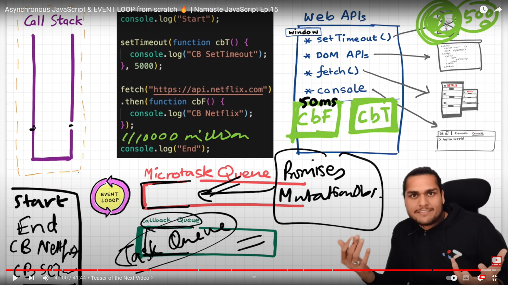

# Contents
1. [What is NodeJS?](#what-is-node-js)
2. [Create a Node Server](#create-a-node-server)
3. [What is middleware in NodeJS?](#nodejs-middleware)
2. [What is callback hell?](#what-is-callback-hell)
3. [What is Inversion Of Control?](#what-is-inversion-of-control)
4. [How to escape from a callback hell?](#how-to-escape-from-a-callback-hell)
5. [What is Promis.all()?](#what-is-promisall)
6. [How to choose node_modules?](#how-to-choose-node_modules)
7. [What is the difference between Authentication and Authorization](#what-is-the-difference-between-authentication-and-authorization)
8. [How do you secure the API?](#how-do-you-secure-the-api)
9. [How to build authentication api?](#how-to-build-authentication-api)
10. [Explain async await and why we use it?](#explain-async-await-and-why-we-use-it)
11. [What is javascript Promise?](#what-is-javascript-promise)
12. [How to write unit test with mocha framework and chai assertion library?](#how-to-write-unit-test-with-mocha-framework-and-chai-assertion-library)
13. [What is callback?](#what-is-callback)
14. [setTimeout vs setInterval](#settimeout-vs-setinterval)
15. [Streams in NodeJS](#streams-in-nodejs)
16. [What is pipe method in NodeJS/ Stream chaining](#what-is-pipe-method-in-nodejs-stream-chaining)
17. [What is child process](#what-is-child-process)
18. [How to scale NodeJs applications using the cluster module?](#how-to-scale-nodejs-applications-using-the-cluster-module)
19. [Why we use express.js on top of nodejs?](#why-we-use-expressjs-on-top-of-nodejs)
20. [Error Handling in NodeJS](#error-handling-in-nodejs)

## What is node js?
Node.js is the JavaScript runtime environment that is based on Google’s V8 Engine i.e. with the help of Node.js we can run the JavaScript outside of the browser. Other things that you may or may not have read about Node.js is that it is single-threaded, based on event-driven architecture, and non-blocking based on the I/O model.
Node.js application runs only on a single thread and by that, It means whether that Node.js application is being used by 5 users or 5 million users, it will only run on a single thread which makes the Node.js application blockable (which means that a single line of code can block the whole app because an only single thread is being used). So, to keep the Node.js application running, asynchronous code must be used everywhere having callback functions because as we know that asynchronous code keeps on running in the background and the callback gets executed as soon as the promise gets resolved rather than synchronous code which blocks the whole application until it gets finished executing. But, we can still use synchronous code however at some place in our application and that place is before our application enters Event-loop. Event-loop is what allows Node.js applications to run non-blocking asynchronous I/O-based operations i.e, all the asynchronous code is managed and executed within the event-loop and before that, we can use our synchronous code which is in this case known as Top-Level code



**[⬆ Back to Top](#contents)**

## Create a Node Server
**Using HTTP**
```
const http = require('http');
const host = 'localhost';
const port = 3000;

const server = http.createServer((req, res)=> {
  res.statusCode = 200;
  res.setHeader('Content-Type', 'text/plain');
  res.end('Hello World');
})

server.listen(port, host, ()=> {
  console.log(`Server running @ http://localhost:3000`)
});
```

**Using Express Framework**
```
const express = require('express');
const host = 'localhost';
const port = 3000;

const app = express();

app.get('/', (req, res)=> {
  res.status(200).send('Hello World')
})

app.listen(port, host, ()=> {
  console.log(`Server running @ http://localhost:3000`)
})
```

**[⬆ Back to Top](#contents)**

## [NodeJS Middleware](https://mindmajix.com/middleware-in-node-js)
Middleware is nothing but a function that has access to response objects, request objects, and the next middleware function. It exists in between the request and response cycles of Node.JS execution. With middleware Node.JS, we can do a multitude of things. To begin with, we can run any codes with middleware functions. Also, we can make changes in response and request objects. We can end the request and response cycle in Node.JS execution. Further, we can call the next middleware function in the queue for Node.JS execution.

**Next() function**
The next ( ) function plays a vital role in applications' request and response cycle. It is a middleware function that runs the next middleware function once it is invoked. In other words, the Next function is invoked if the current middleware function doesn’t end the request and response cycle. It is essential to note that no middleware function should be hanging in the queue.

There are many types of node.JS middleware, such as application-level, router-level, built-in, error-handling, and third-party middleware.

* application-level - Know that every GET and POST call needs authentication. So, if you need to authenticate GET and POST calls, you can develop authentication middleware. 
    ```
    router.use(middleware.isAuthenticated);
    ```
* router-level - By using the `express.Router()` function, this middleware supports creating and managing instances. 
* built-in
    - Static: They are functions that act as static assets to applications. HTML files and images are a few examples of static assets.
    ```
    app.use(express.static('public'));
    ```
    - JSON: This function processes incoming requests along with the JSON payloads.
    ```
    app.use(express.json());
    ```
    - Express.URL-encoded: This function processes incoming requests along with URL-encoded payloads.
    ```
    app.use(express.urlencoded({ extended: true }));
    ```
1. Morgan - Logger
    ```
    const logger = require('morgan');
    app.use(logger('dev'))
    ```
2. Cors - Cross Origin Resourse Sharing
3. Cookie Parser - Parse Cookie header and populate req.cookies with an object keyed by the cookie names. Optionally you may enable signed cookie support by passing a secret string, which assigns req.secret so it may be used by other middleware.
4. Cache - Caching the resposne
5. JSON - Allow json request body
6. URL-Encoded - Process incoming request along with URL-encoded payloads
7. Error Handling - Handle any error
    ```
    // error handler
    app.use(function(err, req, res, next) {
        res.status(err.status || 500);
        res.json({
            message: err.message,
            error: req.app.get('env') === 'development' ? err : {}
        })
    });
    ```
8. Authorization
    ```
    app.use('/users', isLoggedIn, usersRouter);
    ```
9. Express Slowdown
10. Express Rate Limiter

**[⬆ Back to Top](#contents)**

## What is callback hell?
Callback Hell is essentially nested callbacks stacked below one another forming a pyramid structure. Every callback depends on/waits for the previous callback, thereby making a pyramid structure that affects the readability and maintainability of the code.
```
setTimeout(()=> {
    console.log('Hello')
    setTimeout(()=> {
        console.log('NodeJS');
        setTimeout(()=> {
            console.log('World')
        }, 1000)
    }, 1000)
}, 1000)
```

**[⬆ Back to Top](#contents)**

## What is Inversion Of Control?
when we pass a function to other function as a callback we are giving the called function the control of whether to even call it or not or maybe call it in a wrong context. For example a success callback is called when an error occours inside a called function (maybe due to human error while writing the code  for called function), this type of giving up of control over our functions is known as inversion of control.

**[⬆ Back to Top](#contents)**

## How to escape from a callback hell?
* JavaScript provides an easy way of escaping from callback hell. This is done by event queue and promises.
* A promise is a returned object from any asynchronous function, to which callback methods can be added based on the previous function’s result.
* Promises use .then() method to call async callbacks. We can chain as many callbacks as we want and the order is also strictly maintained.
* Promises use .fetch() method to fetch an object from the network. It also uses .catch() method to catch any exception when any block fails.
* So these promises are put in the event queue so that they don’t block subsequent JS code. Also once the results are returned, the event queue finishes its operations.
* There are also other helpful keywords and methods like async, wait, set timeout() to simplify and make better use of callbacks.

**[⬆ Back to Top](#contents)**

## What is Promis.all()?
It is actually a method of Promise object that returns a single Promise after receiving one or more promises as input. when all of the Promises in the input are satisfied, the returning promise is fulfilled. when any of the inputs, or promises are refused, it rejects a promise with this first rejection reason.
```
Promise.all(promise1, promiese2, ...).then(result=> {}).catch(error=> console.log(error))
```
```
try {
  let result = Promise.all([first_promise, second_promise, third_promise]);
  result.then((data) => console.log(data));
} catch (error) {
  console.log(error);
}
```

**[⬆ Back to Top](#contents)**

## How to choose node_modules?
### Factors
* Number of downloads
* How recently updated
* History of updates (has it been updated often over a long period of time)
* Number of contributors
* Have well-known/trusted developers and maintainers started it? [a]
* Do other important packages depend on it? [b]
* Is the package well-documented and has its own website?
* Does the module have test coverage?
### Github factors: 
updated: As of npm 1.2.20 and forward, modules without repository fields will show missing repository fields warning. (Nice touch to put a little pressure on people to package up their modules correctly.)
* Number of forks
* Number of commits
* Are issues being closed on GitHub, or have the same issues been open for a long time?

**[⬆ Back to Top](#contents)**

## What is the difference between Authentication and Authorization
-------------------------------------------------------------------
| Authentication | Authorization |
|----   | ---------
|In the authentication process, the identity of users are checked for providing the access to the system.      | While in authorization process, a the person’s or user’s authorities are checked for accessing the resources.
|In the authentication process, users or persons are verified.      | While in this process, users or persons are validated.
|Authentication determines whether the person is user or not.   | While it determines What permission does the user have?
|Popular Authentication Techniques- Password-Based Authentication, Passwordless Authentication,
2FA/MFA (Two-Factor Authentication / Multi-Factor Authentication), Single sign-on (SSO), Social authentication  |Popular  Authorization Techniques- Role-Based Access Controls (RBAC), JSON web token (JWT) Authorization, SAML Authorization, OpenID Authorization, OAuth 2.0 Authorization

**[⬆ Back to Top](#contents)**

## How do you secure the API?
### Use throttling and rate-limiting: 
Throttling involves setting a temporary state that allows the API to evaluate every request and is often used as an anti-spam measure or to prevent abuse or denial-of-service attacks. There are two primary considerations when implementing the throttling feature: how much data should be allowed per user, and when should the limit be enforced?
On the other hand, rate-limiting helps administer REST API security by avoiding [DoS](https://crashtest-security.com/denial-of-service-attack/) and [Brute force attacks](https://crashtest-security.com/brute-force-attacks/). In some APIs, developers set soft limits, which allow clients to exceed request limits for a brief duration. Setting timeouts is one of the most straightforward API security best practices, as it can handle both synchronous and asynchronous requests

### Express Rate Limit
Basic rate-limiting middleware for Express. Use to limit repeated requests to public APIs and/or endpoints such as password reset. Plays nice with express-slow-down. This module does not share state with other processes/servers by default. If you need a more robust solution, I recommend using an external store.
```
const rateLimit = require('express-rate-limit');

const limiter = rateLimit({
    windowMs: 15 * 60 * 1000,   // 15 minutes
    max: 100,                   // Limit each IP to 100 requests per window per minutes
    standardHeaders: true,      // Return ratelimit info in the `Ratelimit - *` headers
    legacyHeaders: false        // Disable `X-Ratelimit-*` headers
});

// Apply rate limiting middleware to all the requests
app.use(limiter);
```

### Express Slow Down
Basic rate-limiting middleware for Express that slows down responses rather than blocking them outright. Use to limit repeated requests to public APIs and/or endpoints such as password reset. Plays nice with Express Rate Limit

Note: this module does not share state with other processes/servers by default. Memory Store (default, built-in) - stores hits in-memory in the Node.js process. when using express-slow-down and express-rate-limit with an external store, you'll need to create two instances of the store and provide different prefixes so that they don't double-count requests.
```
const slowDown = request('express-slow-down');

app.enable("trust proxy");  // // only if you're behind a reverse proxy (Heroku, Bluemix, AWS if you use an ELB, custom Nginx setup, etc)

const speedLimiter = slowDown({
    windowMs: 15 * 60 * 1000,   // 15 mins
    delayAfter: 100,            // allow 100 requests per 15 minutes, then...
    delayMs: 500                // begin adding 500ms of delay per request above 100:
                                // request # 101 is delayed by  500ms
                                // request # 102 is delayed by 1000ms etc.
});

// apply to all the requests
app.use(speedLimter);
```

### Using JWT Authorization
```
const jwt = require('jsonwebtoken');

const payload = {
    id,
    first_name,
    email
};

const token = jwt.sign(payload, JWT_SECRET, {
    expiresIn: JWT_TTL
});

jwt.verify(payload, JWT_SECRET, (err, decoded)=> {
    if(!err){
        return decoded;
    }
})
```

### Use HTTPS/TLS for REST APIs
HTTPS and Transport Layer Security (TLS) offer a secured protocol to transfer encrypted data between web browsers and servers. Apart from other forms of information, HTTPS also helps to protect authentication credentials in transit. As one of the most critical practices, every API should implement HTTPS for integrity, confidentiality, and authenticity. In addition, security teams should consider using mutually authenticated client-side certificates that provide extra protection for sensitive data and services. When building a secure REST API, developers should avoid redirecting HTTP to HTTPS, which may break API client security. Adequate steps should also be taken to divert Cross-Origin Resource Sharing (CORS) and JSONP requests for their fundamental vulnerabilities for cross-domain calls.

### Using CORS in middleware
CORS is a security mechanism that blocks web pages from accessing resourses from a different domain by default. It enables the browser to check with the server and receive permission to access the requested resources based on the security policy configured on the server.
```
const cors = require('cors');

// Enable all domain to access the resources
app.use(cors());

const corsOption = {
    origin: 'https://example.com'
};

// Only enable example.com to access the resource
app.use(cors(corsOption))
```

**[⬆ Back to Top](#contents)**

## How to build authentication api?
### Method 1
```
const bcrypt = require('bcrypt');
const jwt = require('jsonwebtoken');

module.exports.login = async function(req, res, next) {
    const email = req.body.email;
    const password = req.body.password;

    // Get user from db by email
    const user = getByEmail(email);
    
    if(user){
        const isSame = await bcrypt.compare(password, dbPassword);
        if(isSame){
            const payload = {
                id: user.id,
                first_name: user.first_name,
                email: user.email
            };

            const token = jwt.sign(payload, JWT_SECRET, {
                expiresIn: JWT_TTL
            });

            res.json({
                token
            })
        }
    }
}
```
### Method 2
[Cookie Documentation](https://github.com/sjMalik/node-express-postgres-auth/blob/main/README.md#authentication)
```
const bcrypt = require('bcrypt');

module.exports.login = async function(req, res, next) {
    const email = req.body.email;
    const password = req.body.password;

    // Get user from db by email
    const user = getByEmail(email);
    
    if(user){
        const isSame = await bcrypt.compare(password, dbPassword);
        if(isSame){
            const isSecure = req.app.get('env') !== 'development';
            res.cookie('user_id', user.id, {
                httpOnly: true,
                secure: isSecure,
                signed: true
            });
            res.json({
                id: user.id
            })
        }
    }
}
```

**[⬆ Back to Top](#contents)**

## Explain async await and why we use it?
We all know that JavaScript is Synchronous in nature which means that it has an event loop that allows you to queue up an action that won’t take place until the loop is available sometime after the code that queued the action has finished executing.
But there are a lot of functionalities in our program which make our code Asynchronous and one of them is the Async/Await functionality. Async/Await is the extension of promises which we get as support in the language. 

**Async:** It simply allows us to write promises-based code as if it was synchronous and it checks that we are not breaking the execution thread. It operates asynchronously via the event loop. Async functions will always return a value. It makes sure that a promise is returned and if it is not returned then JavaScript automatically wraps it in a promise which is resolved with its value.

**Await:** Await is used to wait for the promise. It could be used within the async block only. It makes the code wait until the promise returns a result. It only makes the async block wait.
```
const fs = require('fs');
const util = require('util');

const readfile = util.promisify(fs.readFile);

async function readFile(){
    try{
        const data = await readfile('./README.md');
        console.log(data);
    }catch(err){
        console.log(err)
    }
}

readFile()
```

**[⬆ Back to Top](#contents)**

## What is javascript Promise?
Promises are used to handle asynchronous operations in JavaScript. They are easy to manage when dealing with multiple asynchronous operations where callbacks can create callback hell leading to unmanageable code.

Promises are the ideal choice for handling asynchronous operations in the simplest manner. They can handle multiple asynchronous operations easily and provide better error handling than callbacks and events.
A Promise has four states: 
* fulfilled: Action related to the promise succeeded
* rejected: Action related to the promise failed
* pending: Promise is still pending i.e. not fulfilled or rejected yet
* settled: Promise has fulfilled or rejected
```
function getPromise(flag) {
    return new Promise((resolve, reject)=> {
        if(flag){
            resolve('Its Resolved')
        }else{
            const err = new Error('Something error happened')
            reject(err)
        }
    })
}

getPromise(true)
    .then(result=> console.log(result))
    .catch(err=> console.log(err))
```

## How to write unit test with mocha framework and chai assertion library?
**describe() and it()**

The `it` call identifies each individual tests but by itself it does not tell Mocha anything about how your test suite is structured. How you use the `describe` call is what gives structure to your test suite.
```
const expect = require('chai').expect;
const foo = 'bar';
const a = {b: 1};

describe('Unit Testing Example', ()=> {
    before(()=> {
        console.log('It will execute before test start')
    });
    beforeEach(()=> {
        console.log('It will execute before each test start')
    });

    it('2 + 2 will be equal to 4', ()=> {
        expect(2+2).equal(4);
    });

    it('String match', ()=> {
        expect(foo).to.be.a('string');
        expect(foo).to.equal('bar');
        expect(foo).to.have.length(3);
    });

    it('Testing Object', ()=> {
        expect(a).to.have.property('b')
    });

    
    afterEach(()=> {
        console.log('It will execute after each test')
    });
    after(()=> {
        console.log('It will execute after all test')
    });
})
```

**[⬆ Back to Top](#contents)**

## [What is Callback](https://www.geeksforgeeks.org/javascript-callbacks/)
A callback is a function that is passed as an argument to another function, and is called after the main function has finished its execution. The main function is called with a callback function as its argument, and when the main function is finished, it calls the callback function to provide a result. Callbacks allow you to handle the results of an asynchronous operation in a non-blocking manner, which means that the program can continue to run while the operation is being executed.
```
function mainFunction(callback) {
    setTimeout(()=> {
        callback('Operation completed')
    }, 1000);
}

mainFunction(function (result) {
    console.log("Result: ", result);
})
```

**[⬆ Back to Top](#contents)**

## setTimeout vs setInterval
* The setTimeout() method is used to call a function after a certain period of time. 
* The setInterval() Javascript method is used to call a function repeatedly at a specified interval of time. 
* setTimeout() is cancelled by clearTimeout() method, and 
* setInterval() is cancelled by clearInterval() method.
```
var intervalID = setInterval(alert(), 1000); // Will alert every second.
// clearInterval(intervalID); // Will clear the timer.

setTimeout(alert(), 1000); // Will alert once, after a second.
```

**[⬆ Back to Top](#contents)**

## [Streams in NodeJS](https://www.youtube.com/watch?v=DfIfgd9TjB4&ab_channel=Pepcoding)
Streams are a type of data-handling methods and are used to read or write input into output sequentially/ chunk by chunk. Streams are used to handle reading/writing files or exchanging information in an efficient way.

Note: What makes streams powerful while dealing with large amounts of data is that instead of reading a file into memory all at once, streams actually read chunks of data, processing its content data without keeping it all in memory.

**Types of Streams in Node.js:**
There are namely four types of streams in Node.js.
* Writable: Write data to the destination. Example: fs.createWriteStream().
* Readable: Read data from source. Example: fs.createReadStream().
* Duplex: Streams that are both, Writable as well as Readable. Example: net.socket.
* Transform: Streams that can modify or transform the data as it is written and read. Example: zlib.createDeflate

`readStream.js`
```
const fs = require('fs');

let content = "";

const readStream = fs.createReadStream('./streams/input.txt');

readStream.on('data', (chunk)=> {
    content+= chunk;
});

readStream.on('end', ()=> {
    console.log(content)
});

readStream.on('error', (err)=> {
    console.log(err.stack)
});
```

`writeStream.js`
```
const fs = require('fs');

const writeStream = fs.createWriteStream('./streams/output.txt');

writeStream.write('Hi Surajit', 'utf8');

writeStream.end();

writeStream.on('finish', ()=> {
    console.log('Writing Completed')
})
```

**[⬆ Back to Top](#contents)**

## [What is pipe method in NodeJS/ Stream chaining](https://www.geeksforgeeks.org/node-js-stream-readable-pipe-method/)
The pipe() method was added in Node version 0.9. 4. We use this method to join or pipe two streams together. Basically, this method is called on a readable stream to pass data to write onto a writable stream.
```

// Node.js program to demonstrate the    
// readable.pipe() method
  
// Accessing fs module
var fs = require("fs");
 
// Create a readable stream
var readable = fs.createReadStream('input.txt');
 
// Create a writable stream
var writable = fs.createWriteStream('output.txt');
 
// Calling pipe method
readable.pipe(writable);
 
console.log("Program Ended");
```

**[⬆ Back to Top](#contents)**

## [What is child process](https://www.freecodecamp.org/news/node-js-child-processes-everything-you-need-to-know-e69498fe970a/)

Video Refernce: https://www.youtube.com/watch?v=bbmFvCbVDqo&ab_channel=MafiaCodes

Single-threaded, non-blocking performance in Node.js works great for a single process. But eventually, one process in one CPU is not going to be enough to handle the increasing workload of your application.

No matter how powerful your server may be, a single thread can only support a limited load.

`The fact that Node.js runs in a single thread does not mean that we can’t take advantage of multiple processes and, of course, multiple machines as well.`

We can easily spin a child process using Node’s child_process module and those child processes can easily communicate with each other with a messaging system.

The child_process module enables us to access Operating System functionalities by running any system command inside a, well, child process.

We can control that child process input stream, and listen to its output stream. We can also control the arguments to be passed to the underlying OS command, and we can do whatever we want with that command’s output.

There are four different ways to create a child process in Node: spawn(), fork(), exec(), and execFile().

N.B: `exec` and `execFIle` taken all the output into buffer. If there huge statndard output then we wont be able to use this command. It will show error `maxBuffer length exceed`

Thats why in such case we need `spawn()` method.

```
const {exec} = require('child_process');

exec('dir', (err, output)=> {
    if(err){
        console.log(err.stack);
        return;
    }
    console.log(output);
})
```
```
const {execFile} = require('child_process');

execFile('someFile.exe', (err, output)=> {
    if(err){
        console.log(err.stack);
        return;
    }
    console.log(output);
})
```
```
const {spawn} = require('child_process');

const child = spawn('where', ['*']);

child.stdout.on('data', (data)=> {
    console.log(data);
});

child.on('error', (err)=> {
    console.log(err.stack)
});

child.on('exit', (code, signal)=> {
    if(code) console.log('Process exit with code ', code);
    if(signal) console.log('Process exit with signal ', signal);
    console.log('👍👍')
})
```
**fork()**
Reference: 
1. https://github.com/trulymittal/nodejs-child-process-tutorial/blob/master/fork_demo.js
2. https://www.youtube.com/watch?v=7cFNTD73N88&ab_channel=MafiaCodes

**[⬆ Back to Top](#contents)**

## [How to scale NodeJs applications using the cluster module?](https://www.youtube.com/watch?v=9RLeLngtQ3A&ab_channel=MafiaCodes)
Since v6.0.X Node.js has included the cluster module straight out of the box, which makes it easy to set up multiple node workers that can listen on a single port. Note that this is NOT the same as the older learnboost "cluster" module available through npm.
```
const express = require('express');
const cluster = require('cluster');
const os = require('os');

const app = express();
// Number of cores present inside our porcessor
let numCpu = os.cpus.length;
// console.log('Number of Cores ', numCpu);

app.get('/', (req, res)=> {
    for(let i=0; i< 1e8; i++){
        // Some long running tasks
    };

    // Cluster module uses the round robin approach
    // First worker server first, then next.. then it will go again to first when reach end
    res.status(200).send(`Ok... ${process.pid}`);
    
    // Whichever worker will respond to request we need to kill that worker
    // cluster.worker.kill();
});

/**
 * Use cluster module to check whether the process is master process or not. If its master process then we'll simply fork a new worker process
 * and then we'll start listening inside the worker process. Master process wont be listening for any request but only the worker processes would be listening some port
 */
if(cluster.isMaster) {
    // Create as many workers as the number of cpus present inside our processor
    // child_process.fork() method will create workers
    // If you have a single core cpu then instead of numCPU you  can provide numbers more than 1
    numCpu = 3;
    for(let i = 0; i < numCpu; i++){
        cluster.fork();
    }
    // If any worker died we will listen this event and print
    cluster.on('exit', (worker, code, signal)=> {
        console.log(`Worker ${worker.process.pid} died;`);
        // As soon as a worker is killed or it has crashed for any reason then a new instance of that worker will be initiallized
        // And we always have our instances up and runnning
        cluster.fork();
    })
}else{
    // Here we have the worker processes
    // The workers will share the same port dont need to create different port for different workers
    app.listen(3000, ()=> console.log(`Server ${process.pid} @ http://localhost:3000`))
}
```
Load Test
```
npm i loadtest -g
loadtest [-n requests] [-c concurrency] URL
loadtest -n 1000 -c 100 http://localhost:3000
```
Workers will compete to accept new connections, and the least loaded process is most likely to win. It works pretty well and can scale up throughput quite well on a multi-core box.

If you have enough load to care about multiple cores, then you are going to want to do a few more things too:

1. Run your Node.js service behind a web-proxy like Nginx or Apache - something that can do connection throttling (unless you want overload conditions to bring the box down completely), rewrite URLs, serve static content, and proxy other sub-services.
2. Periodically recycle your worker processes. For a long-running process, even a small memory leak will eventually add up.
3. Setup log collection / monitoring

PS: There's a discussion between Aaron and Christopher in the comments of another post (as of this writing, its the top post). A few comments on that:

* A shared socket model is very convenient for allowing multiple processes to listen on a single port and compete to accept new connections. Conceptually, you could think of preforked Apache doing this with the significant caveat that each process will only accept a single connection and then die. The efficiency loss for Apache is in the overhead of forking new processes and has nothing to do with the socket operations.
* For Node.js, having N workers compete on a single socket is an extremely reasonable solution. The alternative is to set up an on-box front-end like Nginx and have that proxy traffic to the individual workers, alternating between workers for assigning new connections. The two solutions have very similar performance characteristics. And since, as I mentioned above, you will likely want to have Nginx (or an alternative) fronting your node service anyways, the choice here is really between:

**[⬆ Back to Top](#contents)**

## [Why we use express.js on top of nodejs?](https://intellipaat.com/blog/what-is-express-js/)
ExpressJS is a fast, flexible, and minimalist web framework that makes building web applications easier and more efficient. It's built on top of Node.js, which is a popular platform for creating server-side applications.

ExpressJS is a bridge between the front-end and back-end of a web application. It acts as the intermediary that processes data and information between the two, making it possible for users to interact with the application in real-time.

This framework also includes a range of helpful features, such as middleware, routing, and templating, that make it easier to develop and maintain a web application.

**Features of ExpressJS**

* Routing: ExpressJS provides a simple and organized way to handle different HTTP requests and map them to specific actions. This allows you to define different paths for your website or API and specify what should happen when a user visits each one.
* Middleware: ExpressJS uses middleware to process incoming requests before they reach their final destination. This allows you to perform tasks such as authentication, validation, and logging in a reusable and modular manner.
* Templating: ExpressJS includes built-in support for several popular templating engines, such as EJS and Jade, which make it easier to create dynamic and interactive pages.

**[⬆ Back to Top](#contents)**

## [Error Handling in NodeJS](https://blog.logrocket.com/error-handling-node-js/)
There are four fundamental strategies to report errors in Node.js:

1. try…catch blocks
2. Callbacks
3. Promises
4. Event emitters

**try…catch blocks**
In the try…catch method, the try block surrounds the code where the error can occur. In other words, we wrap the code for which we want to check errors; the catch block handles exceptions in this block.
```
const fs = require('fs');

try{
    const data = fs.readFileSync('./input.txt');
}catch(err){
    console.log(err)
}
console.log('Some important code to execute');
```

**Callbacks**

A callback function (commonly used for asynchronous code) is an argument to the function in which we implement error handling.

The purpose of a callback function is to check the errors before the result of the primary function is used. The callback is usually the final argument to the primary function, and it executes when an error or outcome of the operation emerges.
```
const fs = require('fs');

fs.readFile('./input.txt', (err, data)=> {
  if(err){
    console.log(err);
    return
  }
  console.log(data)
});
console.log('Some important code to execute');
```

**Promise**

```
const fs = require('fs');
const util = require('util');

const readfile = util.promisify(fs.readFile);

readfile('./input.txt').then(data=> console.log(data))
  .catch(err=> console.log(err.stack));

console.log('Some important code to execute');
```

**async/await**
```
const fs = require('fs');
const util = require('util');

(async ()=> {
  try{
    const data = await readfile('./input.txt');
  }catch(err){
    console.log(err.stack)
  }
})();

console.log('Some important code to execute');
```

**Event Emitter**

```
const {spawn} = require('child_process');

const child = spawn('dir', ['']);

child.stdout.on('data', (data)=> {
  console.log(data);
});

child.on('error', (err)=> {
  console.log(err.stack)
})
```

**[⬆ Back to Top](#contents)**

## Create a promise response true if resolved and false if rejected. Achieve the same with async and await

```
function getPromise(flag) {
  return new Promise((resolve, reject)=> {
    if(flag){
      resolve('Resolved')
    }else{
      const err = new Error('Rejected');
      reject(err)
    }
  })
}

getPromise(false)
  .then(data=> console.log(data))
  .catch(err=> console.log(err.message));

async function getAsyncPromise(flag) {
  if(flag) return 'Resolved';
  else throw new Error('rejected')
}

(async ()=> {
  try{
    const data = await getAsyncPromise(false);
  }catch(err){
    console.log(err.message)
  }
})();
```

## Authentication using JWT
```
const jwt = require('jsonwebtoken');

const payload = {
  name,
  email,
  org_id
};

const token = jwt.sign(payload, JWT_SECRET, {
  expiresIn: JWT_TTL
});

jwt.verify(token, JWT_SECRET, (err, decoded)=> {
  if(!err){
    console.log(decoded)
  }
})
```

